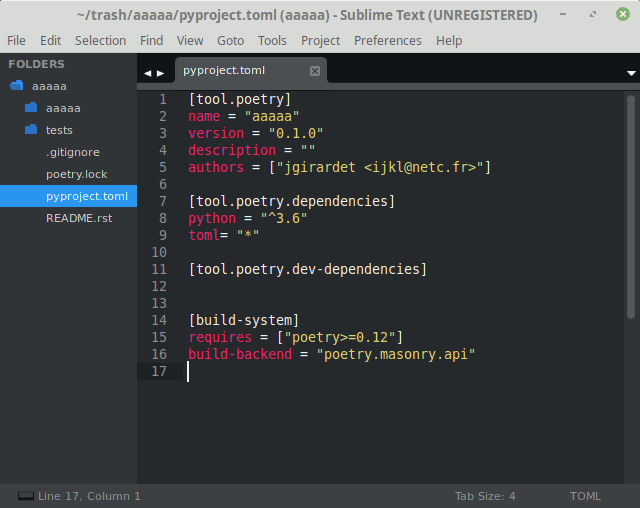

.. image:: https://travis-ci.org/jgirardet/sublime-poetry.svg?branch=master
    :target: https://travis-ci.org/jgirardet/sublime-poetry

.. image:: https://ci.appveyor.com/api/projects/status/ffd44ndqx713yuhd/branch/master?svg=true
    :target: https://ci.appveyor.com/project/jgirardet/sublime-poetry

===============================
sublime-poetry
===============================

`Poetry`_ integration for SublimeText

* License : GNU General Public License v3 or later (GPLv3+) 
* Source: https://github.com/jgirardet/sublime-poetry

WARNING : THIS IS STILL AN ALPHA RELEASE
-----------------------------------------

Installation
-------------

#. Install `Poetry`_ (if you haven't already):

#. In PackageControl just find ``poetry``, and that's it !

#. or install manually by navigating to Sublime's `Packages` folder and cloning this repository under the name `poetry`::

      git clone https://github.com/jgirardet/sublack.git poetry

Usage
--------

Use `Ctrl-Shift-P` (Mac: `Cmd-Shift-P`). A pyproject.toml file with a poetry section should exists at root folder to make the commands enabled.

* Poetry: Set python interpreter:
	Change `python_interpreter` in your project_settings to make your project match your virtualenv.

* Poetry: Install:
    Run `poetry install` on current project.

* Poetry: Install --no-dev:
    Run `poetry install --no-dev` on current project.

* Poetry: Install in Selected Venv:
    Find Available python interpreters on system and create .venv with selected python version then Run `poetry install` on current project.

* Poetry: Update:
    Run `poetry update` on current project.

* Poetry: Add a package:
    Run `poetry add {package_name}` on current project.

* Poetry: Add dev package:
    Run `poetry add -D {package_name}` on current project.

* Poetry: Remove package:
    Run `poetry remove {package_name}` on current project. If it's a dev-dependencie `-D` is added to the command line.

* Poetry: Build:
    Run `poetry build` on current project.

* Poetry: Publish:
    Run `poetry build` on current project.

* Poetry: Bump Version:
    Show current version and run `poetry version` on current project and let you choose between : patch minor major prepatch preminor premajor prerelease.

* Poetry: Init:
    run `poetry init -n`, to create new pyproject.toml file.

*Poetry: Config:
    Manage poetry configuration, repositories and authentication.

Settings
---------

Poetry will always look for settings in the following order:
 - First in project file : first with poetry prefix then in a subsetting (see Project settings).
 - Then in Users global settings
 - finally in poetry's default settings

Global settings
*****************
Preferences -> Package Settings -> poetry -> settings : 

* poetry_log:
    Show non error messages in console. Default = info.

Project settings
*******************

Just add poetry as prefix (recommended):

.. code-block:: json

    {
    "settings":{
        "poetry.poetry_log": "debug"
        }
    }

A poetry subsettings is still possible:

.. code-block:: json

    {
    "settings":{
        "poetry":{
            "poetry_log": "debug"
            }
        }
    }

Issues
---------

If there is something wrong with this plugin, `add an issue <https://github.com/jgirardet/sublime-poetry/issues>`_ on GitHub and I'll try to address it.

Changelog
-----------

see `install.txt <messages/install.txt>`_ 

Contributing
--------------

* remove poetry via Package Control.
* fork sublime-poetry
* clone your poetry fork  to your Packages folder (Preferences -->  Browse Packages...). folder has to be named `poetry` and not `sublime-poetry`::
	
	git clone https://github.com/you/sublime-poetry.git poetry
* Package Control: Satisfy Dependencies.
* install UnitTesting in Package Control
* adding a test for new features or bugfix is really nice	 if you can.
* add your name to Authors in readme.

Authors
---------

Laboriously coded by Jimmy Girardet

contributions by:

.. _Poetry : https://github.com/sdispater/poetry 
